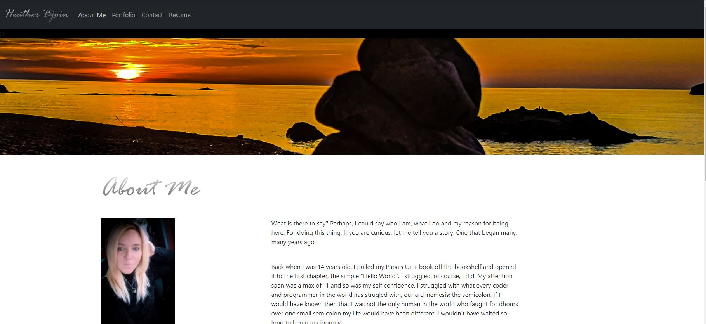

# reactPortfolio
Portfolio take 2. 

  ## Table of Contents
  * [The Assignment](##Assignment)
  * [Link](#link)
  * [Comments](#comments)
  * [Technologies](#technologies)
  * [Questions](#questions) 
  * [License](#license)

## Assignment

The revamped portfolio, bigger, better. . . REACT! This is a single-page application that deploys a portfolio created with ReactJS. 

## The Results

## Link to Demo 

https://heatmarie.github.io/reactPortfolio/#info

## Comments 

This just so happens to be my first creation with React. Here I discovered Material UI and my love for the both ReactJS and Material UI. There are still plenty of fancy things I can add here, more so if I had the time, but as with all the apps, it's a good start and a fun experience getting play with React. 

## Technologies
- React.js
- JavaScript
- npm 
    - Bootstrap
    - Material UI

## Contact Information 

### Heather Bjoin 

  ### For any questions or comments feel free to contact me by using the email below.
  
  <a href="mailto:h.m.bjoin@gmail.com">Email</a>

  ### To see more projects: 

  <a href="https://github.com/HeatMarie">Github</a>

## License
  
  
                MIT License

          Copyright (c) 2021, Heather Bjoin

          Permission is hereby granted, free of charge, to any person obtaining a copy
          of this software and associated documentation files (the "Software"), to deal
          in the Software without restriction, including without limitation the rights
          to use, copy, modify, merge, publish, distribute, sublicense, and/or sell
          copies of the Software, and to permit persons to whom the Software is
          furnished to do so, subject to the following conditions:

          The above copyright notice and this permission notice shall be included in all
          copies or substantial portions of the Software.

          THE SOFTWARE IS PROVIDED "AS IS", WITHOUT WARRANTY OF ANY KIND, EXPRESS OR
          IMPLIED, INCLUDING BUT NOT LIMITED TO THE WARRANTIES OF MERCHANTABILITY,
          FITNESS FOR A PARTICULAR PURPOSE AND NONINFRINGEMENT. IN NO EVENT SHALL THE
          AUTHORS OR COPYRIGHT HOLDERS BE LIABLE FOR ANY CLAIM, DAMAGES OR OTHER
          LIABILITY, WHETHER IN AN ACTION OF CONTRACT, TORT OR OTHERWISE, ARISING FROM,
          OUT OF OR IN CONNECTION WITH THE SOFTWARE OR THE USE OR OTHER DEALINGS IN THE
          SOFTWARE.

